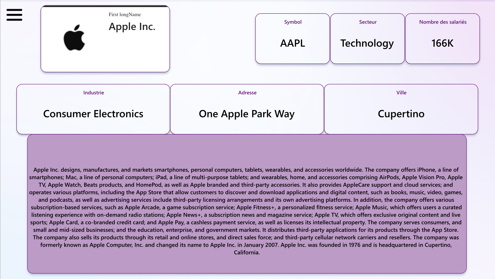
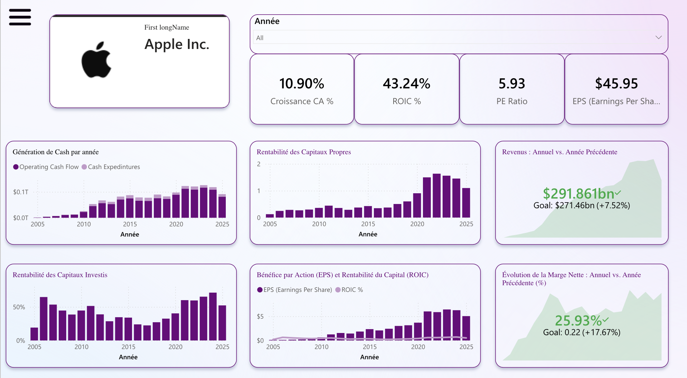
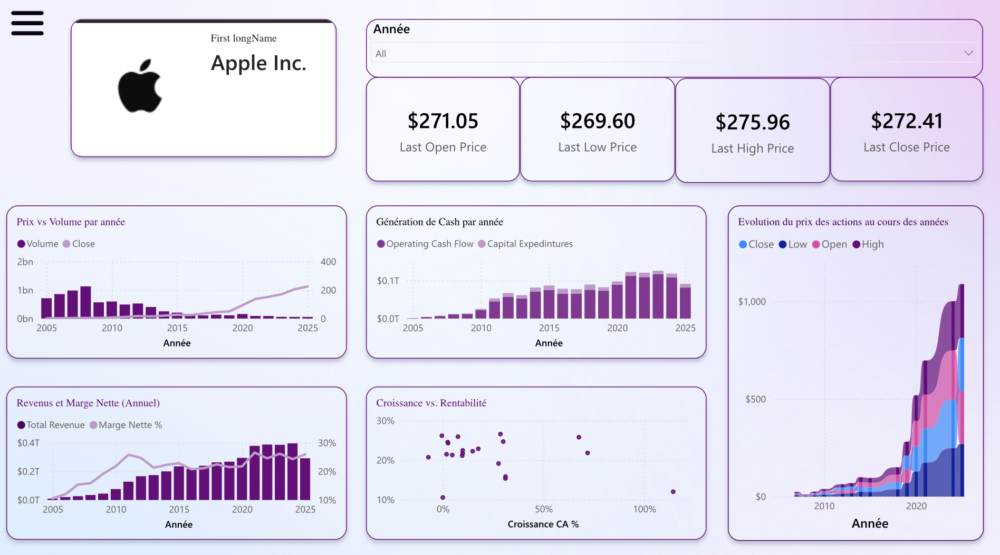
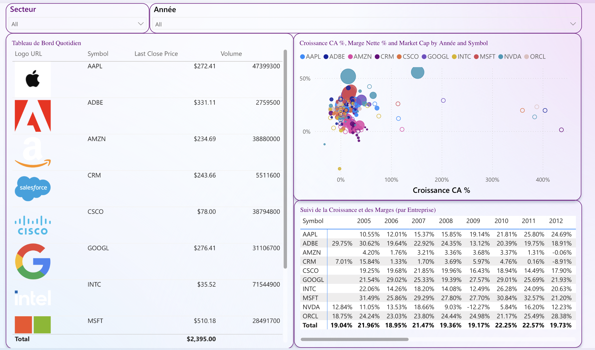

# Finance Data Auto — Pipeline & Dashboard Financier des Big Tech

> Pipeline automatisé Python + Dashboard Power BI interactif pour le suivi financier des **10 plus grandes entreprises technologiques** cotées en bourse.

---

## Aperçu du projet

Ce projet combine **ingestion automatisée de données financières** et **visualisation interactive** pour analyser la santé financière, la performance boursière et la croissance des géants de la tech (AAPL, MSFT, GOOGL, AMZN, NVDA, ORCL, INTC, ADBE, CSCO, CRM).

**Composants principaux :**
- Un script Python (`update_data.py`) qui collecte les **cours boursiers** (via *yfinance*) et les **états financiers trimestriels** (via *Alpha Vantage*) depuis 2005
- Un **workflow GitHub Actions** qui automatise la mise à jour périodique des données
- Un **rapport Power BI** (`.pbix`) à 4 pages interactives pour explorer les données

---

## Entreprises suivies

| Symbol | Entreprise | Secteur |
|---|---|---|
| AAPL | Apple Inc. | Technology |
| MSFT | Microsoft | Technology |
| GOOGL | Alphabet (Google) | Technology |
| AMZN | Amazon | Consumer Cyclical |
| NVDA | NVIDIA | Technology |
| ORCL | Oracle | Technology |
| INTC | Intel | Technology |
| ADBE | Adobe | Technology |
| CSCO | Cisco Systems | Technology |
| CRM | Salesforce | Technology |

---
### Fichiers générés (par entreprise)
- `{TICKER}_prices.csv` — historique des cours (Open, High, Low, Close, Volume)
- `{TICKER}_financials_income.csv` — compte de résultat trimestriel
- `{TICKER}_financials_balance.csv` — bilan trimestriel
- `{TICKER}_financials_cashflow.csv` — tableau des flux de trésorerie trimestriels

---

## Aperçu du Dashboard Power BI

Le rapport est structuré en **4 pages** accessibles via un menu latéral :

### Profile — Fiche d'identité de l'entreprise

Présentation synthétique : nom, ticker, secteur, industrie, adresse, ville, nombre de salariés et description complète de l'activité.



### Overview — Indicateurs de rentabilité et de croissance

Vue d'ensemble des KPIs clés : **Croissance CA %**, **ROIC %**, **PE Ratio**, **EPS**, ainsi que les graphiques d'évolution du cash flow, de la rentabilité des capitaux propres/investis et des revenus avec comparaison vs. année précédente (avec objectifs).



### Overview 2 — Analyse boursière approfondie

Focus sur les prix boursiers (Open / Low / High / Close), la relation **Prix vs Volume**, l'évolution multi-courbes des cours, le scatter plot **Croissance vs. Rentabilité** et le tandem **Revenus / Marge Nette**.



### Comparaison — Tableau de bord multi-entreprises

Vue comparative de toutes les entreprises : tableau quotidien (cours de clôture + volume avec logos), bubble chart **Croissance CA % × Marge Nette × Market Cap**, et matrice historique des marges par symbole et par année.



---

## Structure du dépôt

```
finance-data-auto/
├── .github/
│   └── workflows/              # Pipeline GitHub Actions (automatisation)
├── data/                       # Fichiers CSV générés (prix + fondamentaux)
├── screenshot/                # Captures du dashboard (à ajouter au repo)
│   ├── 01_profile.png
│   ├── 02_overview.png
│   ├── 03_overview2.png
│   └── 04_comparison.png
├── update_data.py              # Script principal de collecte
├── Rapport intéractive.pbix    # Dashboard Power BI
└── README.md
```

---

## Installation et utilisation

### Prérequis
- **Python 3.10+**
- Une clé API **Alpha Vantage** gratuite ([obtenir une clé](https://www.alphavantage.co/support/#api-key))
- **Power BI Desktop** pour ouvrir le fichier `.pbix`

### Installation des dépendances

```bash
pip install pandas yfinance requests alpha_vantage
```

### Exécution manuelle du script

```bash
# Sous Linux/macOS
export ALPHA_VANTAGE_KEY="votre_clé_api"
python update_data.py

# Sous Windows (PowerShell)
$env:ALPHA_VANTAGE_KEY="votre_clé_api"
python update_data.py
```

Les fichiers CSV générés sont placés dans le dossier `data/`.

### Automatisation via GitHub Actions

Le workflow `.github/workflows/` exécute automatiquement le script. Pour l'activer dans votre fork :

1. Allez dans **Settings → Secrets and variables → Actions**
2. Ajoutez un nouveau secret : `ALPHA_VANTAGE_KEY` avec votre clé API
3. Le workflow s'exécutera automatiquement selon la planification définie

### Ouvrir le dashboard

1. Lancer **Power BI Desktop**
2. Ouvrir `Rapport intéractive.pbix`
3. **Refresh** les données pour charger les CSV les plus récents du dossier `data/`

---

## Technologies utilisées

| Outil | Usage |
|---|---|
| **Python** | Langage principal du pipeline |
| **yfinance** | Récupération des cours boursiers historiques |
| **Alpha Vantage** | API pour les états financiers (income, balance, cash flow) |
| **pandas** | Manipulation et structuration des données |
| **GitHub Actions** | Orchestration et planification du pipeline |
| **Power BI** | Visualisation interactive et modélisation DAX |

---

## Limites et notes

- L'API gratuite **Alpha Vantage** est limitée à **25 requêtes/jour** : le script intègre des `time.sleep()` pour respecter le rate limit, mais une exécution complète peut nécessiter plusieurs jours selon le quota
- Les données financières sont en **fréquence trimestrielle**
- L'historique commence au **30 septembre 2005**
- Le dashboard nécessite Power BI Desktop (gratuit) pour être consulté hors publication sur Power BI Service

---

## Perspectives d'évolution

- Étendre la liste des entreprises suivies (S&P 500, autres secteurs)
- Intégrer des modèles de **prédiction de cours** (LSTM, Prophet, ARIMA)
- Ajouter une couche de **sentiment analysis** sur les actualités financières
- Publier le rapport sur **Power BI Service** pour un accès web temps réel
- Ajouter des **indicateurs techniques** (RSI, MACD, Bollinger Bands)

---

## Auteur

**Houda Mouradi** — [@houdamouradi](https://github.com/houdamouradi)
